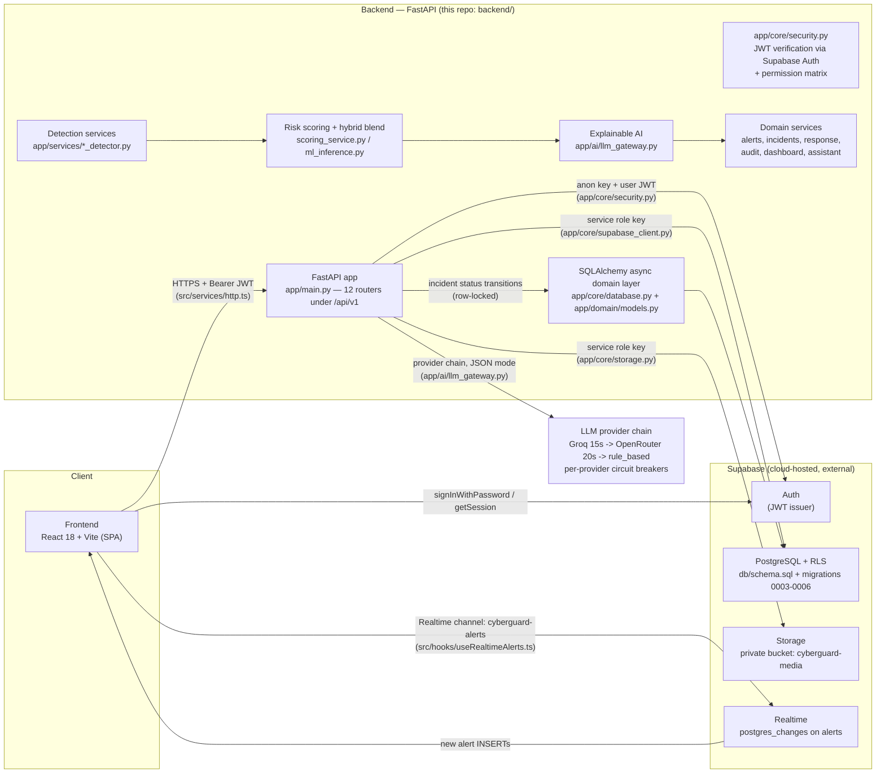

# CYBERGUARD System Architecture

AI-Powered Cyber Threat, Phishing & Digital Impersonation Detection and Response System.

## High-Level Architecture



The backend is the only holder of the **service role key**; the browser only ever holds the **anon key** plus the per-user JWT issued by Supabase Auth.

## Ingestion pipeline

Two ingestion surfaces write org-scoped rows into the `events` table (`event_status`: received → analyzing → completed/failed):

1. **Raw ingestion** — `POST /events/{email|url|message|auth-log|network|api-log|media}` stores the validated payload as an event with status `received`; media additionally uploads the file to the private `cyberguard-media` bucket (25 MB cap, sanitized file name) and inserts a `media_files` row.
2. **Analysis pipeline** — `POST /analysis/{email|url|impersonation|account-takeover|network|media}` stores an event with status `analyzing`, then runs detection → scoring → explanation → alert creation in one request and returns the finished alert.
3. **Bulk ingestion** — `POST /events/bulk` (`kind: "auth-log" | "network"`, max 1000 rows, else 400) stores one event and analyses it synchronously (`app/services/bulk_analysis.py`), answering 200 with the final status.

## Detection engines

Six heuristic detectors under `app/services/` produce typed indicators with severities (critical/high/medium):

| Module | Detector | ML model |
|---|---|---|
| phishing | `phishing_detector.py` (email + SMS text heuristics) | TF-IDF + XGBoost (`email_tfidf.pkl`, `email_phishing_xgb.pkl`) |
| url | `url_detector.py` (lexical forensics) | XGBoost over 8 lexical features (`url_xgb.pkl`) |
| impersonation | `impersonation_detector.py` (BEC/authority heuristics) | — (heuristics only) |
| account_takeover | `account_takeover_detector.py` (bursts, impossible travel) | — (no trained model yet) |
| network / api_abuse | `network_threat_detector.py` (exfiltration, C2 ports, API abuse) | scaler + XGBoost on KDD99 SF features (`network_scaler.pkl`, `network_xgb.pkl`) |
| deepfake | `deepfake_detector.py` + `media_forensics/` (ELA images/videos, WAV audio) | MobileNetV3-Small 128px on GenImage (`deepfake_cnn_v2.pt`, the single neural artifact) |

Model cards and metrics: [`docs/models.md`](models.md).

## Monotonic hybrid blending rule

`app/services/ml_inference.py` applies one blend consistently across all ML-backed detectors:

```
hybrid_score = max(heuristic_score, round(0.45 * heuristic_score + 0.55 * ml_probability * 100))
```

**Safety principle:** a trained model may raise a score but may never lower it below the heuristic verdict (a C2-port exfiltration event must not be downgraded to Safe because the model saw no similar attack). The ML contribution is appended as a `type: "ml_model"` indicator carrying the numeric probability; `split_ml_indicator()` removes it before the heuristic score (`calculate_score` over non-ML indicators) is computed, so ML weight is never double-counted. When a model is missing or `ML_ENABLED=false`, predictors return `None`, no `ml_model` indicator is appended, and hybrid == heuristic.

## Explainable AI and explanation_provider provenance

`app/ai/llm_gateway.py` tries providers strictly in order — Groq (`GROQ_TIMEOUT_SECONDS`, default 15 s) → OpenRouter (`OPENROUTER_TIMEOUT_SECONDS`, default 20 s) → a local rule-based template — and returns as soon as one succeeds. Providers never produce scores; they only write the strict-JSON explanation contract (`explanation`, `mitre_techniques`, `recommended_actions`; the SOC assistant uses `json_mode=false`).

Every analysis response carries:

- `explanation_provider`: `groq` | `openrouter` | `rule_based` | `cache:<original_provider>`
- `explanation_latency_ms`: measured round-trip (0 on cache hits)

Successful explanations are cached (TTL 3600 s, max 256 entries, thread-safe LRU) keyed by sha256 of module name + normalized input (sha256 of file bytes for media). Each provider failure logs one warning line: `LLM provider <name> failed after <ms> ms: <reason>`.

## Incident domain: NIST state machine and row locking

`app/domain/incident_lifecycle.py` enforces a strict NIST/SANS lifecycle:

```
TRIAGE ──> CONTAINMENT ──> ERADICATION ──> RECOVERY ──> CLOSED
   │             │
   │ (false      │ (containment failed,
   │  positive)  │  escalate back)
   └──> CLOSED   └──> TRIAGE
```

`PATCH /api/v1/incidents/{id}/status` (`routes_incidents.py`) loads the incident through the SQLAlchemy domain layer with **`with_for_update()` row locking** — two simultaneous PATCHes cannot both pass `validate_transition` — and only then commits the status change plus the timeline event in one transaction. Legacy statuses (`open`/`investigating`/`contained`/`closed`) are normalized onto the lifecycle. Illegal transitions are rejected with **400** naming the required path (e.g. `Cannot transition from CONTAINMENT to CLOSED. Must go through ERADICATION and RECOVERY first.`) before anything is written; cross-tenant ids resolve to **404**. Transitioning to CLOSED additionally requires the `incident.close` permission.

## Multi-tenancy enforcement

Every user, event, alert, incident and audit row carries `org_id` (migration 0004); the service-role client bypasses RLS, so the **service layer is the primary enforcement**:

- `get_current_user` resolves the caller's org via `get_user_org_id(user_id)` (`profiles.org_id`, 5-minute LRU cache with maxsize 1024, "Default Organization" fallback — which `_get_default_org_id()` even auto-creates, mirroring migration 0006).
- Every SELECT filters `.eq("org_id", org_id)` and every INSERT carries the caller's org — in alert_service, incident_service, dashboard_service, audit_service, routes_analysis, routes_events, routes_alerts and the SQLAlchemy incident queries.
- Cross-tenant ids resolve to 404 (incidents, events, media re-analysis, alert detail).
- Row Level Security is enabled on every table as **defence in depth**; the anonymous surface cannot tamper outside policy even if the anon key leaks.

## Permission matrix

Migration 0005 seeds `permissions` (16 keys) + `role_permissions`; `app/core/security.py` resolves roles to keys (60-second per-role cache) with the identical matrix hardcoded as a fail-safe fallback. `require_permission(key)` / `require_permissions(*keys)` guard every endpoint with `403 Missing permission: <key>`; `has_permission` implements in-handler conditional gates (`incident.close` on the CLOSED transition, `response.execute_destructive` on approval-required catalog entries); `require_role` remains a backward-compatible alias.

| Permission key | viewer | analyst | admin |
|---|---|---|---|
| dashboard.view, alerts.view, incidents.view, reports.view | ✅ | ✅ | ✅ |
| analysis.run, media.upload | — | ✅ | ✅ |
| incident.create, incident.update, incident.escalate, incident.close | — | ✅ | ✅ |
| alert.acknowledge, alert.resolve | — | ✅ | ✅ |
| response.execute | — | ✅ | ✅ |
| audit.view | — | ✅ | ✅ |
| response.execute_destructive | — | — | ✅ |
| users.manage | — | — | ✅ |

New signups default to `viewer` (migration 0003 sets the default; the trigger writes `viewer`).

## Analysis execution (synchronous)

The Phase C-1 background worker queue (Arq + Redis, `202 Accepted` flow) was **removed**. `POST /analysis/media` and `POST /events/bulk` run the full pipeline synchronously on the request thread and answer **200** with the finished result; blocking IO still never touches the event loop (threadpool rule below). The bulk-log pipeline lives in `app/services/bulk_analysis.py` (the former worker coroutine, idempotent for completed events); the `redis` compose service and `arq`/`redis` packages remain only as unused standalone infrastructure.

## Circuit breaker states

Each remote LLM provider is wrapped in its own `AsyncCircuitBreaker` (`app/ai/async_circuit_breaker.py` — custom implementation because pybreaker is synchronous and would block the event loop):

- **CLOSED** — normal operation; consecutive failures are counted.
- **OPEN** — after 3 consecutive failures; every call is rejected instantly with `CircuitBreakerOpenError` for the 60 s recovery window. The gateway logs `Circuit breaker OPEN for <provider>, skipping to fallback` and moves to the next provider immediately.
- **HALF_OPEN** — after the recovery window; exactly one probe call is allowed. Success closes the breaker, failure re-opens it for another window.

A sustained LLM outage therefore costs zero added latency (instant rule-based fallback) instead of the full 20 s + 60 s timeout chain.

## Rate limiting (removed)

The Phase D-1 token-bucket middleware (`app/core/rate_limit.py`, `RATE_LIMIT_RPM`, `429` + `Retry-After`) was **removed** — requests are no longer throttled. `/health*` liveness semantics are unchanged.

## Threadpool rule (Phase D-1)

Blocking IO never runs on the event loop: every supabase-py call, Supabase Auth round-trip, storage upload/download and ELA/CNN inference invoked from an async context goes through `app/core/asyncbridge.to_thread` (Starlette's threadpool) or is a plain `def` route. Examples: JWT verification in `security.py`, media forensics in `routes_analysis.py` and `services/bulk_analysis.py`, file uploads (read exactly once, never re-reading the `SpooledUploadFile`).

## Cache TTLs and invalidation (Phase D-2)

| Cache | TTL | Invalidated by |
|---|---|---|
| Verified auth context (identity keyed by sha256 of bearer token) | 60 s | `invalidate_user(user_id)` |
| Profile role (per user) | 60 s | `invalidate_user(user_id)` |
| Role permission matrix (per role) | 60 s | natural expiry (roles change rarely) |
| User organization (per user, LRU maxsize 1024) | 5 min | `invalidate_user(user_id)` |
| Explanation cache (per normalized input, LRU max 256) | 3600 s | natural expiry |
| LLM connectivity probe behind `GET /health` | 30 s | natural expiry |

`invalidate_user(user_id)` is called by `PATCH /admin/users/{user_id}/role` immediately after a role change, so privilege changes take effect right away instead of at cache expiry: it clears the profile-role cache, every cached token-derived auth context for that user, and the org resolution entry.

## Security Model

1. **Two Supabase keys, strictly separated** — the anon key is public (frontend sign-in, backend JWT verification); the service role key is backend-only and bypasses RLS for the pipeline.
2. **JWT authentication** — `get_current_user` validates the bearer token with `supabase.auth.get_user(token)` on the anon client; invalid/expired tokens get `401` with `WWW-Authenticate: Bearer`. The frontend refreshes the session once on a 401 (`src/services/http.ts`).
3. **CORS boot guard** — the API refuses to boot when `CORS_ORIGINS` contains `*` while `allow_credentials` is enabled.
4. **Human-in-the-loop responses** — approval-required catalog actions return 403 unless `approved: true` **and** the caller holds `response.execute_destructive`; every execution is audit-logged (audit writes retry once, then fall back to `evidence/logs/audit_fallback.jsonl`).
5. **Input hardening** — Pydantic validation returns structured 400s (never 422); media uploads are capped at 25 MB (413) and restricted to image/video/audio; file names are sanitized; alert search escapes PostgREST `ilike` wildcards; `GET /db/check` answers 500 `database check unavailable` instead of leaking Supabase errors.
6. **Secrets** — all secrets come from environment variables; `.env.example` files document them without real values.
