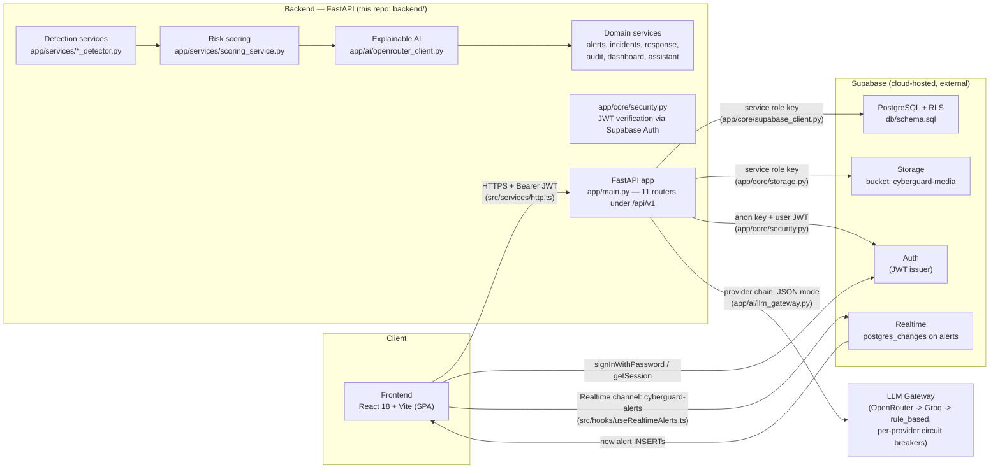

# CYBERGUARD System Architecture

AI-Powered Cyber Threat, Phishing & Digital Impersonation Detection and Response System.

## High-Level Architecture



The backend is the only holder of the **service role key**; the browser only ever holds the **anon key** plus the per-user JWT issued by Supabase Auth.

## Component Inventory (actual codebase)

| Layer | Module | Responsibility |
|---|---|---|
| API | `app/main.py` | FastAPI app, CORS, routers, validation (400) and global (500) JSON error handlers |
| API | `app/api/routes_health.py` | `GET /api/v1/health` liveness + Supabase connectivity |
| API | `app/api/routes_events.py` | Multi-source ingestion (`/events/email`, `/url`, `/message`, `/auth-log`, `/network`, `/api-log`, `/media`) |
| API | `app/api/routes_analysis.py` | Detection pipelines (`/analysis/email|url|impersonation|account-takeover|network|media`) and alert reads |
| API | `app/api/routes_alerts.py` | Alert list/search/filter, detail, status transitions |
| API | `app/api/routes_incidents.py` | Incident CRUD-lite: create, list, detail, status (NIST/SANS state-machine-gated), assign, escalate |
| API | `app/api/routes_response.py` | Response catalog, approval-gated execution, history |
| API | `app/api/routes_dashboard.py` | Aggregated dashboard summary (Python-side grouping) |
| API | `app/api/routes_audit.py` | Audit trail reads |
| API | `app/api/routes_assistant.py` | SOC assistant chat |
| Core | `app/core/config.py` | pydantic-settings (`SUPABASE_*`, `DATABASE_URL`, `OPENROUTER_*`, `GROQ_*`, `*_TIMEOUT_SECONDS`, `API_V1_PREFIX`, `CORS_ORIGINS`) |
| Core | `app/core/supabase_client.py` | Service-role client singleton + `check_connection()` (Auth / Storage / Realtime) |
| Core | `app/core/security.py` | `get_current_user` (HTTPBearer → `supabase.auth.get_user`), `require_role` |
| Core | `app/core/storage.py` | Media upload (25 MB cap), 1-hour signed URLs, download |
| Core | `app/core/database.py` | Async SQLAlchemy engine (asyncpg, `pool_pre_ping`, `pool_size=10`, `max_overflow=20`), `async_sessionmaker`, `get_db_session` FastAPI dependency |
| Domain | `app/domain/models.py` | ORM models over the existing Supabase tables: `IncidentModel`, `IncidentEventModel`, `AlertModel`, `IncidentAlertLinkModel` |
| Domain | `app/domain/incident_lifecycle.py` | Strict NIST/SANS state machine (`VALID_TRANSITIONS` matrix, `validate_transition`, legacy status normalization, `InvalidStateTransitionError` → 400) |
| AI | `app/ai/async_circuit_breaker.py` | Coroutine-safe circuit breaker (CLOSED/OPEN/HALF_OPEN, failure_threshold=3, recovery_timeout=60 s) — pybreaker is synchronous and would block the event loop |
| AI | `app/ai/llm_gateway.py` | Provider chain: OpenRouter -> Groq (each behind its own AsyncCircuitBreaker) -> rule-based; explanation cache (TTL 3600 s, 256 entries) |
| AI | `app/ai/openrouter_client.py` | OpenRouter provider (JSON mode) + backward-compatible never-raise wrapper |
| AI | `app/ai/groq_client.py` | Groq provider (OpenAI-compatible endpoint) |
| AI | `app/ai/explanation_cache.py` | Thread-safe LRU explanation cache (sha256 keys, TTL 3600 s, max 256) |
| AI | `app/ai/prompt_templates.py` | System prompts for all 6 modules + SOC assistant |
| Detection | `app/services/phishing_detector.py` | Email + SMS heuristics (lookalike domains, urgency, credential requests, URLs, SMS shortcodes/keywords) |
| Detection | `app/services/url_detector.py` | URL forensics (IP hosts, entropy, extensions, random paths, digit ratio, URLhaus patterns) |
| Detection | `app/services/impersonation_detector.py` | Authority claims, pressure, unusual requests, secrecy |
| Detection | `app/services/account_takeover_detector.py` | Failed bursts, impossible travel, unknown devices, success-after-failures |
| Detection | `app/services/network_threat_detector.py` | Exfiltration volumes, C2 ports, API rate abuse, 401 bursts |
| Detection | `app/services/media_forensics/` | ELA image/video forensics + WAV signal statistics (`deepfake_detector.py` selects) |
| Scoring | `app/services/scoring_service.py` | Indicator weights (critical 25 / high 15 / medium 5), severity bands |
| Data | `db/schema.sql` | 7 enums, 11 tables, indexes, RLS policies, `handle_new_user` trigger, response catalog seed |

## Data Flow (detection-to-response pipeline)

```
Input Source (email, URL, message, auth log, network flow, API log, media file)
    |
    v
Ingestion API            POST /api/v1/analysis/*          (event row, status='analyzing')
    |
    v
Heuristic Engine         app/services/*_detector.py       (indicator list, typed + severities)
    |
    v
Risk Scoring             app/services/scoring_service.py  (risk_score = sum of weights, cap 100;
    |                                                      severity band safe..critical)
    v
Explainable AI           app/ai/llm_gateway.py            (LLM explanation, MITRE mapping,
    |                                                      recommended actions; provider chain
    |                                                      OpenRouter -> Groq -> rule-based template)
    v
Alert Generation         app/services/alert_service.py    (alerts row, recommended_actions rows
    |                                                      matched against response_catalog,
    |                                                      event status -> 'completed')
    v
Dashboard                GET /api/v1/dashboard/summary    (React SOC console)
    ^
    |--- Supabase Realtime pushes new alert INSERTs to the frontend
         (channel `cyberguard-alerts`, hook: src/hooks/useRealtimeAlerts.ts)
```

Every state-changing action (alert status change, incident create/assign/escalate, response execution, assistant query) writes an `audit_logs` row via `app/services/audit_service.py`.

## Incident Lifecycle State Machine (Phase A)

`PATCH /api/v1/incidents/{id}/status` is governed by a strict NIST/SANS lifecycle instead of free-form status changes:

```
TRIAGE ──> CONTAINMENT ──> ERADICATION ──> RECOVERY ──> CLOSED
   │             │
   │ (false      │ (containment failed,
   │  positive)  │  escalate back)
   └──> CLOSED   └──> TRIAGE
```

The request path is: load the incident through SQLAlchemy (`app/core/database.py` → `app/domain/models.py`), normalize the requested status (legacy `open`/`investigating`/`contained`/`closed` map onto the new lifecycle), run `validate_transition(current, new)` against the `VALID_TRANSITIONS` matrix, and only then commit the status change plus the timeline event in one transaction. An illegal move — e.g. CONTAINMENT → CLOSED — is rejected with **400** (`Cannot transition from CONTAINMENT to CLOSED. Must go through ERADICATION and RECOVERY first.`) before anything is written.

## LLM Gateway Circuit Breakers (Phase A)

Each remote provider in the gateway chain is wrapped in its own `AsyncCircuitBreaker` (`app/ai/async_circuit_breaker.py`):

- **CLOSED** — normal operation; consecutive failures are counted.
- **OPEN** — after 3 consecutive failures; every call is rejected instantly with `CircuitBreakerOpenError` for 60 s.
- **HALF_OPEN** — after the 60 s recovery window; exactly one probe call is allowed. Success closes the breaker, failure re-opens it for another window.

When a breaker is OPEN the gateway logs `Circuit breaker OPEN for [provider], skipping to fallback` and moves to the next provider immediately, so a full OpenRouter+Groq outage costs zero added latency (instant rule-based fallback) instead of the previous 100 s + 60 s timeout chain.

## Security Model

1. **Two Supabase keys, strictly separated**
   - **Anon key** — public, safe for the browser. Used by the frontend (`src/lib/supabaseClient.ts`) for sign-in/session and by the backend (`app/core/security.py`) only to *verify* user JWTs.
   - **Service role key** — backend-only (`app/core/supabase_client.py`, `app/core/storage.py`). Bypasses RLS so the detection pipeline can write alerts/actions; never leaves the backend environment and is never committed (`.env` is git-ignored).
2. **JWT authentication** — every protected route depends on `get_current_user` (`app/core/security.py`), which validates the bearer token with `supabase.auth.get_user(token)` on the anon client and returns the caller's `id`/`email`. Invalid or expired tokens receive `401` with `WWW-Authenticate: Bearer`. The frontend refreshes the session once on a 401 (`src/services/http.ts`) and falls back to sign-out.
3. **Row Level Security** — `db/schema.sql` enables RLS on all 11 tables. Direct client access (anon key) is restricted: users read their own profile (`auth.uid() = id`), authenticated users can read/write the operational tables, and the service role bypasses RLS for the pipeline. This means a leaked anon key alone cannot tamper with data outside the policies.
4. **Human-in-the-loop response actions** — catalog actions flagged `requires_approval` return HTTP 403 from `POST /responses/execute` unless `approved: true`; every execution (and rejection path) is audit-logged.
5. **Input hardening** — Pydantic validation returns structured 400s; media uploads are limited to 25 MB (413) and image/video/audio content types; file names are sanitized before storage; LLM output is parsed defensively and every analysis response carries `explanation_provider` / `explanation_latency_ms`; when every provider in the chain (OpenRouter, Groq) fails or returns non-JSON, a rule-based template explanation is generated locally.
6. **Secrets** — all secrets come from environment variables (backend `.env`, frontend `VITE_*`); `.env.example` files document them without real values.
